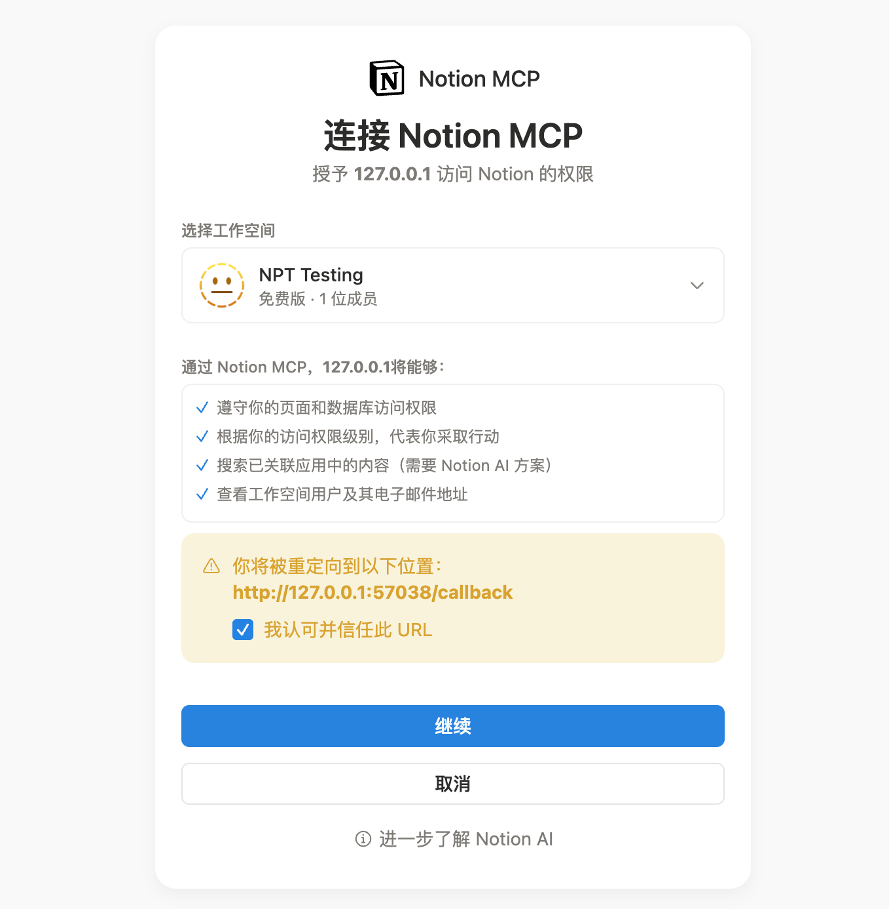
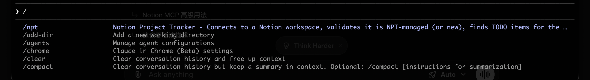
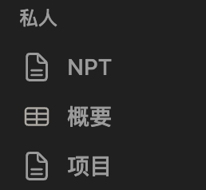
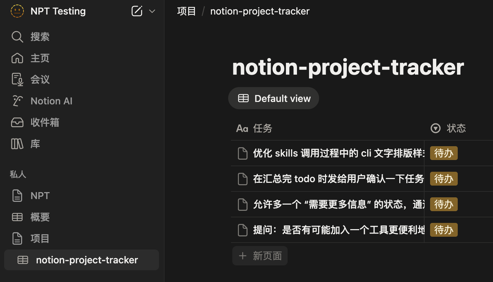

# Notion Project Tracker (NPT)

NPT 是一个技能（Claude Code: `/npt`，Codex: `npt`），通过 Notion MCP + Notion REST 管理项目 TODO。它会自动从 Notion 数据库中获取待办任务，在代码库中执行，并将结果写回 Notion。

## 最短路径（先跑通）

按下面 5 步走，路径最短且不会卡在 API key 权限问题上：

1. 安装技能：`./install.sh`
2. 登录 Notion MCP（Codex）：`codex mcp add notion --url https://mcp.notion.com/mcp && codex mcp login notion`
3. **先执行初始化**（此步骤不依赖 `NOTION_API_KEY`）：
   - Claude: `/npt init`
   - Codex: `npt init`
4. 初始化完成后，再去 Notion 创建/配置 API key，并确保 key 对 `NPT` / `项目` / `概要` 以及项目 TODO 数据库有访问权限
5. 导出 key 并执行：
   - `export NOTION_API_KEY="secret_..."`
   - `npt status` / `npt sync`（或 Claude 使用 `/npt status` / `/npt`）

这个顺序是为了避免死锁：先有工作区结构和项目数据库，再配 key 权限，最后再跑精确查询。

## 使用截图

Notion MCP 授权页（Codex）：



Claude `/npt` 命令可见性：



Notion 中的 NPT 工作区结构（NPT / 概要 / 项目）：



任务汇总确认界面示例：



## 安装

```bash
# 克隆仓库
git clone <repo-url>
cd notion-project-tracker

# 全局安装技能（默认同时安装到 Claude + Codex）
./install.sh

# 只安装 Claude 或 Codex
./install.sh --claude
./install.sh --codex
```

安装后：
- Claude Code 会话中使用 `/npt`
- Codex 会话中通过提示词调用 `npt`（例如 `npt status` / `npt sync`）

## 使用方法

在目标项目目录中运行：

```bash
# Claude Code
/npt              # 完整同步：验证 → 发现任务 → 确认 → 执行 → 回报
/npt auto         # auto 模式开关（持久化到 .npt.json）；不执行 sync
/npt auto on      # 显式开启 auto 模式；不执行 sync
/npt auto off     # 显式关闭 auto 模式；不执行 sync
/npt init         # 仅初始化工作区和注册项目
/npt status       # 仅查看当前任务状态
```

```bash
# Codex（在会话中输入）
npt               # 默认等价 npt sync
npt auto          # auto 模式开关（持久化到 .npt.json）；不执行 sync
npt auto on       # 显式开启 auto 模式；不执行 sync
npt auto off      # 显式关闭 auto 模式；不执行 sync
npt init          # 仅初始化工作区和注册项目
npt status        # 仅查看当前任务状态
```

首次在新项目中使用时，NPT 会自动在 Notion 中创建对应的 TODO 数据库并生成 `.npt.json` 配置文件。
`auto` 模式会写入 `.npt.json` 的 `auto_mode` 字段（可选，默认 `false`）。
开启后，后续执行 `/npt`（或 `npt sync`）会自动跳过确认步骤。
为提升任务发现稳定性，NPT 还会在 `.npt.json` 里可选维护 `known_task_page_ids` / `last_discovery_at` 作为发现缓存。

### Codex 使用

1) 确保 Notion MCP 已登录：

```bash
codex mcp add notion --url https://mcp.notion.com/mcp
codex mcp login notion
```

2) 在目标项目目录启动 Codex，会话里输入（作为提示词）：

```
npt status
npt sync
npt auto
npt init
```

提示：Codex 不支持终端交互式选择。当 NPT 询问确认时，直接在会话里回复 `execute all` / `skip: 1,3` / `abort`。

### 精确查询（推荐：单变量）

最省事的方式是只配置 1 个环境变量：

```bash
export NOTION_API_KEY="secret_..."
```

配置后直接运行 `npt status` / `npt sync` 即可走精确查询。
建议首次使用先 `npt init`，再生成并配置 `NOTION_API_KEY`，以确保页面访问权限覆盖新建的 NPT 结构。
如果未配置 `NOTION_API_KEY` 且无其他可用 token，NPT 会直接报错停止，不会用 MCP 语义搜索兜底。

## 工作原理

1. **工作区验证** — 检查 Notion 工作区是否由 NPT 管理（通过 `NPT` 页面标识）
2. **项目解析** — 通过 `.npt.json` 或目录名匹配对应的 Notion TODO 数据库
3. **任务执行** — 逐个执行待办任务（写代码、修 bug、加功能等）。支持图片描述：任务中的图片会通过 AI 模型进行视觉分析
4. **结果回报** — 将执行结果以评论写回 Notion 页面（不使用折叠块）

## 查询准确性说明（重要）

- 当前 Notion MCP 的 `search` 本质是语义/关键词检索，不等价于“按 `状态` 属性精确过滤”。
- NPT 的查询策略是 API-only：通过技能脚本 `notion_api.py query-active` 走 Notion REST 精确查询，使用 `NOTION_API_KEY`。
- 如果 API 查询不可用或失败，NPT 会直接停止，不再使用 MCP 语义搜索兜底。
- 查询置信度仅在 API 查询成功时输出 `high`。
- 这意味着：没有 API 查询结果就没有任务列表，也不会进入执行阶段。
- 如果你的场景要求严格全量，建议在运行环境接入支持属性过滤的数据源查询能力（或 Notion 官方 Database Query API）。

## Notion 工作区结构

NPT 管理的工作区根目录包含 3 个项：

| 名称   | 类型     | 用途                              |
|--------|----------|-----------------------------------|
| `NPT`  | 页面     | 系统信息 + 会话日志               |
| `项目` | 页面     | 容器页，每个项目的 TODO 数据库是其直接子项 |
| `概要` | 数据库   | 项目元数据（标签、技术栈、同步时间、摘要） |

### TODO 数据库 Schema

| 字段     | 类型              | 说明                                         |
|----------|-------------------|----------------------------------------------|
| 任务     | title             | 任务名称                                     |
| 状态     | select            | 待办 / 队列中 / 进行中 / 需要更多信息 / 已阻塞 / 已完成 |
| 标签     | multi_select      | 完成时自动生成的分类标签（0-5 个）           |
| 上次同步 | last_edited_time  | 自动记录页面最近编辑时间                     |

任务描述写在页面内容中，执行结果通过评论回报。
注意：`已阻塞` 的任务不会被 NPT 自动重试或改动；需要你手动把状态改回 `待办`（或其他活动状态）才会再次进入队列。

## 项目结构

```
.claude/skills/npt/SKILL.md   — 核心技能定义（/npt 命令的全部逻辑）
.claude/skills/npt/scripts/notion_api.py — Notion REST 精确查询辅助脚本
.codex/skills/npt/SKILL.md    — Codex 技能定义（npt）
.codex/skills/npt/scripts/notion_api.py  — Notion REST 精确查询辅助脚本
.mcp.json                     — Notion MCP 服务器配置
templates/.npt.json            — 目标项目的配置模板
install.sh                     — 全局安装脚本
AGENTS.md                      — Codex 兼容指令
CLAUDE.md                      — Claude Code 项目指令
```

## 多设备支持

NPT 按项目名称（非路径）匹配，`.npt.json` 是设备本地文件。不同设备可以在不同路径使用同一个项目，`概要` 中的 `目录路径` 记录最近一次同步的设备路径。

## 兼容性

- **Claude Code** — 通过 `/npt` 技能直接使用
- **Codex** — 通过 `npt` 技能直接使用（也保留 `AGENTS.md` 作为指令兼容/安全边界说明）
