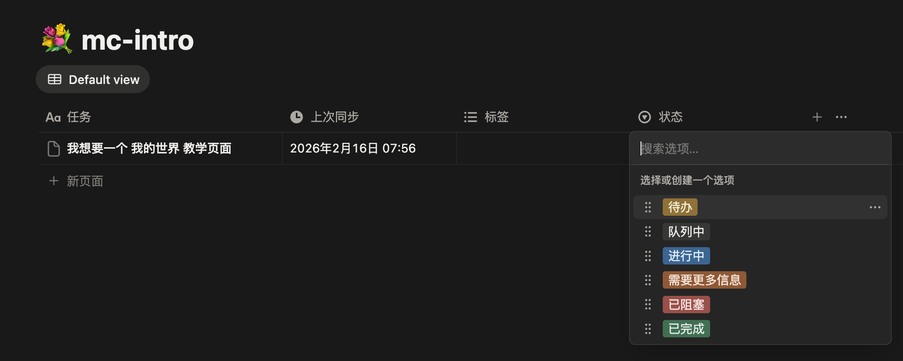
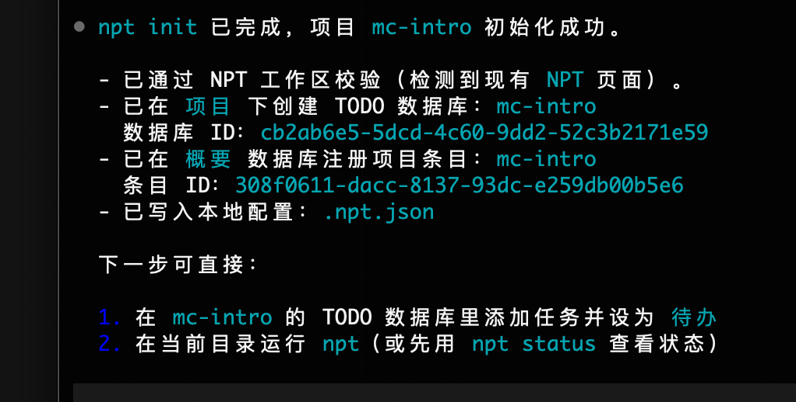
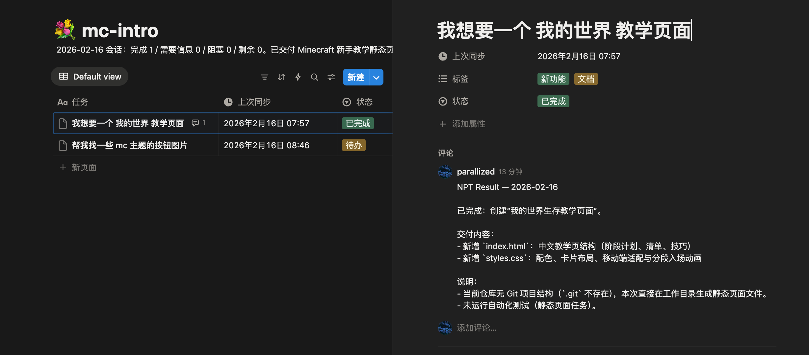

# Notion Project Tracker (NPT)

## 简介

NPT 不是又一个孤立的任务工具，而是把 Notion 变成 AI 可执行的项目中枢：

1. Notion 页面天然支持文字、图片、视频、列表等自由排版，比纯 CLI 输入更适合把复杂需求讲清楚，减少“任务写不明白”的执行误差。
2. 对非开发同学更友好，不需要先搭复杂工作流就能开始协作，用看得见的内容结构直接沉淀知识。
3. 可复用 Notion 的模板、AI 能力和集成生态，NPT 只是执行层，把已有组织资产连到编码流程里。
4. 云端共享 + 权限管理 + 多端访问，手机补充素材、电脑推进实现可以无缝衔接。
5. AI 工作过程可追溯，任务状态、执行结果、评论都沉淀在同一处，后续复盘和继续执行成本低。
6. Notion 的交互体验和信息密度兼顾，不必重复造一个“能看但不好用”的管理界面。
7. 个人知识库与项目执行打通，平时积累的笔记和灵感可以直接转成可执行任务，而不是停留在记录层。

## README


NPT 是一个 Skill（Claude Code: `/npt`，Codex: `npt`），通过 Notion MCP + Notion REST 管理项目 TODO。它会自动从 Notion 数据库中获取待办任务，在代码库中执行，并将结果写回 Notion。

## 怎么用

按下面 5 步走：

1. 克隆该仓库并安装 skill: `./install.sh`
2. 登录 Notion MCP (Codex): `codex mcp add notion --url https://mcp.notion.com/mcp && codex mcp login notion`
3. 在你的项目目录 (文件夹名作为项目名) **先执行初始化**：
   - Claude: `/npt init`
   - Codex: `$npt init`
4. 初始化完成后, 再去 Notion 创建/配置 RestAPI key, 并确保 key 对 Notion MCP 创建的 `NPT` / `项目` / `概要` / `IDEA` 以及项目 TODO 数据库有访问权限
5. 导出 key 并配置环境变量:
   - `export NOTION_API_KEY="secret_..."`
   - `$npt status` / `$npt sync`（或 Claude 使用 `/npt status` / `/npt`）以检查是否配置完成

这个 API key 有些麻烦，是因为 Notion MCP 尚不能很好 query 待办内容，需要补充 RestAPI 能力，也期待哪天完善 MCP 能力就免得这一遭环境变量配置

## 最小执行单元（首次跑通）

如果你想最快体验一次端到端闭环，只要完成下面 4 步：

1. 新建并进入项目文件夹（文件夹名就是项目名）
2. 在 Claude/Codex 里执行 `npt init`（创建并初始化 NPT 专用工作区结构）
3. 在 Notion Dashboard 创建 API key，并设置 `NOTION_API_KEY`
4. 在 Notion 项目 TODO 库新建 1 条 `待办`，回到 CLI 执行 `npt`

### 正常循环（Daily Loop）

1. 在 Notion 写任务单，并把要执行的任务设为 `待办`
2. 在 Claude/Codex 输入 `npt`
3. 在 Notion 评论与会话日志里验收结果，再继续追加后续任务

这个循环的核心价值是“边验收边推进”：你可以做一个验收一个，AI 完成后会把结果回写到 Notion；同时你也可以在 AI 执行期间继续往待办里追加后续任务。

## 安装详解

```bash
# 克隆仓库
git clone <repo-url>
cd notion-project-tracker

# 全局安装技能（默认同时安装到 Claude + Codex）
./install.sh

# 只安装 Claude 或 Codex
./install.sh --claude
./install.sh --codex
```

## 使用截图

初始化成功（`npt init`）：



开始执行任务（将任务设为 `待办`）：



交付详情（状态、标签、评论）：



交付结果总览（任务列表）：


安装后：

- Claude Code 会话中使用 `/npt`
- Codex 会话中通过提示词调用 `npt`（例如 `npt status` / `npt sync`）

## 使用指令

在目标项目目录中运行：

```bash
# Claude Code
/npt              # 完整同步：验证 → 发现任务 → 确认 → 执行 → 回报
/npt auto         # auto 模式开关（持久化到 .npt.json）；不执行 sync
/npt auto on      # 显式开启 auto 模式；不执行 sync
/npt auto off     # 显式关闭 auto 模式；不执行 sync
/npt init         # 仅初始化工作区和注册项目
/npt status       # 仅查看当前任务状态
```

```bash
# Codex（在会话中输入）
npt               # 默认等价 npt sync
npt auto          # auto 模式开关（持久化到 .npt.json）；不执行 sync
npt auto on       # 显式开启 auto 模式；不执行 sync
npt auto off      # 显式关闭 auto 模式；不执行 sync
npt init          # 仅初始化工作区和注册项目
npt status        # 仅查看当前任务状态
```

首次在新项目中使用时，NPT 会自动在 Notion 中创建对应的 TODO 数据库并生成 `.npt.json` 配置文件。
`auto` 模式会写入 `.npt.json` 的 `auto_mode` 字段（可选，默认 `false`）。
开启后，后续执行 `/npt`（或 `npt sync`）会自动跳过确认步骤。
为提升任务发现稳定性，NPT 还会在 `.npt.json` 里可选维护 `known_task_page_ids` / `last_discovery_at` 作为发现缓存。

### Codex 使用

1. 确保 Notion MCP 已登录：

```bash
codex mcp add notion --url https://mcp.notion.com/mcp
codex mcp login notion
```

2. 在目标项目目录启动 Codex，会话里输入（作为提示词）：

```
npt status
npt sync
npt auto
npt init
```

提示：Codex 不支持终端交互式选择。当 NPT 询问确认时，直接在会话里回复 `execute all` / `skip: 1,3` / `abort`。

### 解释一下为什么需要 API

配置后直接运行 `npt status` / `npt sync` 即可走精确查询。
建议首次使用先 `npt init`，再生成并配置 `NOTION_API_KEY`，以确保页面访问权限覆盖新建的 NPT 结构。
如果未配置 `NOTION_API_KEY` 且无其他可用 token，NPT 会直接报错停止，不会用 MCP 语义搜索兜底。

## 工作原理

1. **工作区验证** — 检查 Notion 工作区是否由 NPT 管理（通过 `NPT` 页面标识）
2. **项目解析** — 通过 `.npt.json` 或目录名匹配对应的 Notion TODO 数据库
3. **任务执行** — 逐个执行待办任务（写代码、修 bug、加功能等）。支持图片描述：任务中的图片会通过 AI 模型进行视觉分析
4. **结果回报** — 将执行结果以评论写回 Notion 页面（不使用折叠块）

## Notion 工作区结构

NPT 管理的工作区根目录包含 4 个项：

| 名称   | 类型   | 用途                                           |
| ------ | ------ | ---------------------------------------------- |
| `NPT`  | 页面   | 系统信息 + 会话日志                            |
| `项目` | 页面   | 容器页，每个项目的 TODO 数据库是其直接子项     |
| `概要` | 数据库 | 项目元数据（标签、技术栈、同步时间、摘要）     |
| `IDEA` | 数据库 | 跨项目想法池（灵感沉淀、优先级、关联项目与任务） |

### TODO 数据库 Schema

| 字段     | 类型             | 说明                                                    |
| -------- | ---------------- | ------------------------------------------------------- |
| 任务     | title            | 任务名称                                                |
| 状态     | select           | 待办 / 队列中 / 进行中 / 需要更多信息 / 已阻塞 / 已完成 |
| 标签     | multi_select     | 完成时自动生成的分类标签（0-5 个）                      |
| 想法引用 | relation          | 关联 IDEA 数据库中的想法条目（可选）                    |
| 上次同步 | last_edited_time | 自动记录页面最近编辑时间                                |

任务描述写在页面内容中，执行结果通过评论回报。
注意：`已阻塞` 的任务不会被 NPT 自动重试或改动；需要你手动把状态改回 `待办`（或其他活动状态）才会再次进入队列。

## 项目结构

```
.claude/skills/npt/SKILL.md   — 核心技能定义（/npt 命令的全部逻辑）
.claude/skills/npt/scripts/notion_api.py — Notion REST 精确查询辅助脚本
.codex/skills/npt/SKILL.md    — Codex 技能定义（npt）
.codex/skills/npt/scripts/notion_api.py  — Notion REST 精确查询辅助脚本
.mcp.json                     — Notion MCP 服务器配置
templates/.npt.json            — 目标项目的配置模板
install.sh                     — 全局安装脚本
AGENTS.md                      — Codex 兼容指令
CLAUDE.md                      — Claude Code 项目指令
```

## 多设备支持

NPT 按项目名称（非路径）匹配，`.npt.json` 是设备本地文件。不同设备可以在不同路径使用同一个项目，`概要` 中的 `目录路径` 记录最近一次同步的设备路径。

## 兼容性

- **Claude Code** — 通过 `/npt` 技能直接使用
- **Codex** — 通过 `$npt` 技能直接使用（也保留 `AGENTS.md` 作为指令兼容/安全边界说明）
